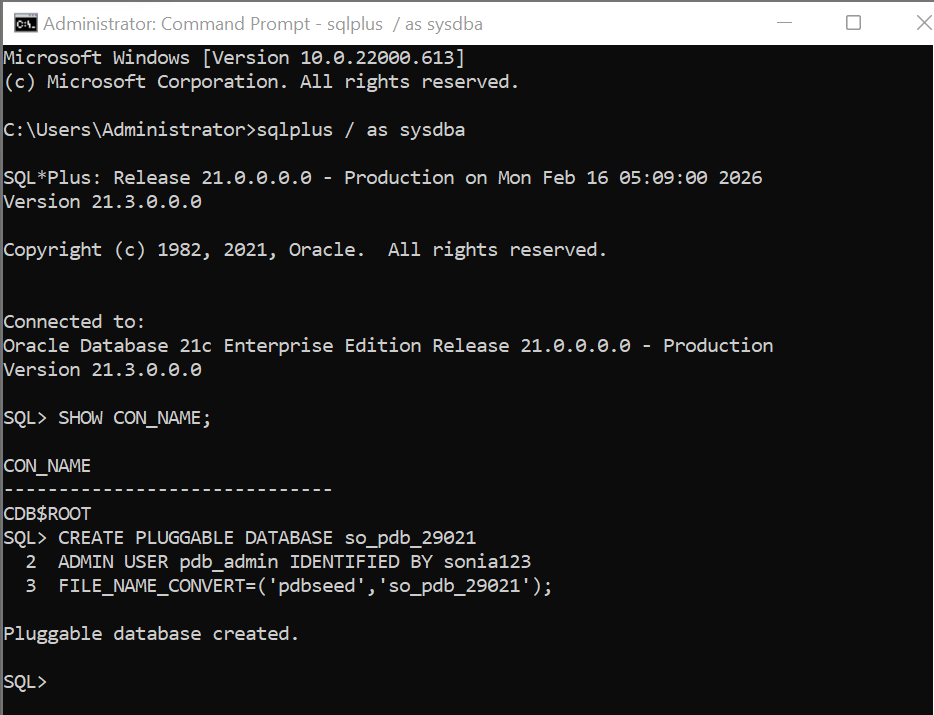
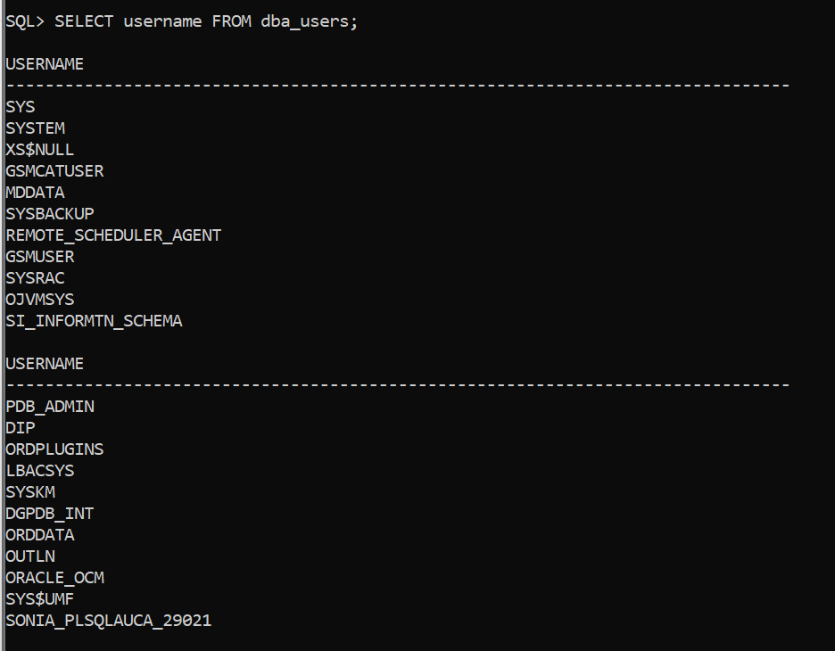
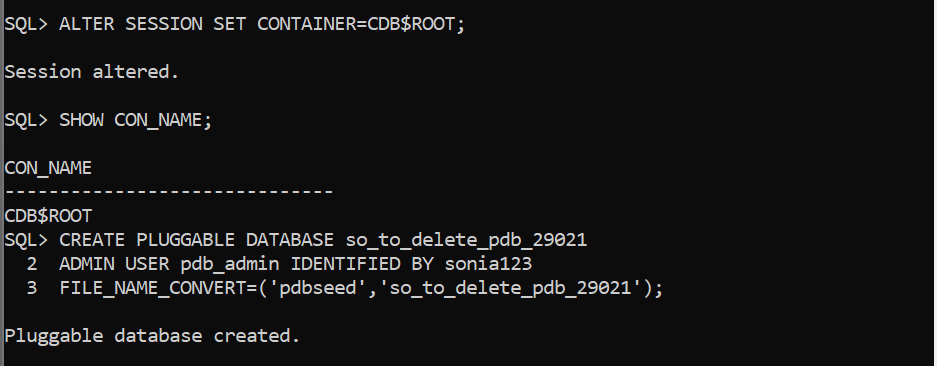
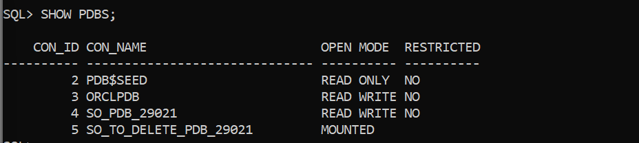
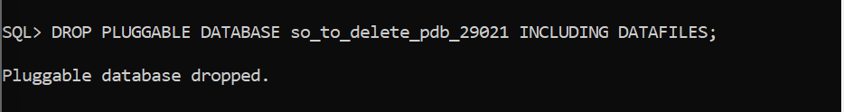
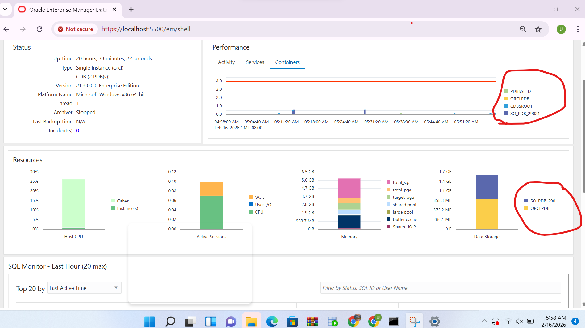

# Pluggable Database Assignment — Oracle Database

## Student Information
- **Name:** Sonia  
- **Student ID:** 29021  
- **Course:** Database Systems  

---

# Assignment Overview

This assignment demonstrates practical understanding of Oracle Multitenant Architecture through:

- Pluggable Database (PDB) creation
- PDB management and monitoring
- User creation inside a PDB
- Temporary PDB creation and deletion
- Oracle Enterprise Manager monitoring

All SQL commands used in this assignment are provided in:

**pluggable_database_assignment.sql**

---

# Oracle Environment Used

- Oracle Database 19c (Multitenant Architecture)
- SQL*Plus command-line interface
- Oracle Enterprise Manager (OEM)
- GitHub for version control and submission

---

# Task 1 — Create a New Pluggable Database

## Naming Conventions Used

### Pluggable Database
so_pdb_29021

### User Inside PDB
sonia_plsqlauca_29021

### Password
sonia123

## Description

This task involved:

- Creating a new pluggable database
- Opening the PDB in READ WRITE mode
- Switching session to the PDB
- Creating a local user inside the PDB
- Granting privileges to the user
- Verifying successful creation

## Evidence

### PDB Creation

### PDB Open State
.png)

### User Created

---

# Task 2 — Create and Delete Temporary PDB

## Temporary PDB Name
so_to_delete_pdb_29021

## Description

This task demonstrated database lifecycle management by:

- Creating a temporary pluggable database
- Verifying its existence
- Closing the database
- Dropping the database including datafiles
- Confirming successful deletion

## Evidence

### Temporary PDB Created

### Temporary PDB Verified

### Temporary PDB Deleted

---

# Task 3 — Oracle Enterprise Manager Monitoring

## Description

This task involved:

- Accessing Oracle Enterprise Manager
- Monitoring Oracle environment
- Verifying the created pluggable database
- Confirming user configuration

## Evidence

---

# Challenges Faced and Solutions

## Issue: ORA-65096 — Invalid Common User Name
**Cause:** Attempted to create a user in the root container (CDB$ROOT).

**Solution:**  
Switched session to the pluggable database before creating the user:

ALTER SESSION SET CONTAINER=so_pdb_29021;

---

## Issue: User Does Not Exist Error
**Cause:** User creation failed due to incorrect container.

**Solution:**  
Verified container using:

SHOW CON_NAME;

Then recreated the user successfully.

---

# Repository Contents

- **README.md** → Assignment report
- **pluggable_database_assignment.sql** → SQL commands used
- **screenshots/** → Evidence of completed tasks

---

# Integrity Statement

I confirm that this work is my own and was completed following academic integrity guidelines.  
All commands were executed personally, and results were documented truthfully.

---

# Final Checklist (Apply Before Submission)

- [x] Correct PDB names used
- [x] User created inside the PDB
- [x] Temporary PDB created and deleted
- [x] OEM dashboard screenshot included
- [x] GitHub repository is PUBLIC
- [x] README is clear and professional
- [x] Deadline respected

---

# Professional & Ethical Note

**Excellence is never an accident; it is the result of discipline, commitment, and integrity.**

As future database professionals, precision, discipline, and integrity are non-negotiable principles that guide responsible system administration and data management.

---

# Conclusion

This assignment successfully demonstrated:

- Oracle pluggable database creation and management
- User administration within a PDB
- Database lifecycle operations
- Oracle Enterprise Manager monitoring
- Proper documentation and version control using GitHub

The tasks strengthened practical knowledge of Oracle database administration and multitenant architecture.
