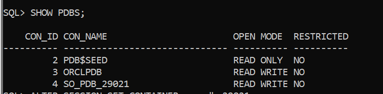

# Pluggable Database Assignment — Oracle Database

## Student Information
- Name: Sonia  
- Student ID: 29021  
- Course: Database Systems  

---

# Assignment Overview

This assignment demonstrates pluggable database creation, management, deletion, and monitoring in Oracle Database.

All SQL commands used in this assignment are provided in:

**pluggable_database_assignment.sql**

---

# Task 1 — Create a New Pluggable Database

## Naming Conventions Used

### Pluggable Database
so_pdb_29021

### User Inside PDB
sonia_plsqlauca_29021

### Password
sonia123

## Description

- Created pluggable database  
- Opened PDB in READ WRITE mode  
- Created user inside PDB  
- Granted privileges  
- Verified user creation  

## Evidence

### PDB Creation

### PDB Open State

### User Created

---

# Task 2 — Create and Delete Temporary PDB

## Temporary PDB Name
so_to_delete_pdb_29021

## Description

- Created temporary PDB  
- Verified existence  
- Deleted PDB including datafiles  
- Confirmed deletion  

## Evidence

### Temporary PDB Created

### Temporary PDB Verified

### Temporary PDB Deleted

### Deletion Confirmed

---

# Task 3 — Oracle Enterprise Manager

## Description

- Accessed Oracle Enterprise Manager  
- Verified Oracle environment  
- Verified created PDB  
- Verified user account  

## Evidence

---

# Repository Contents

- **README.md** → Assignment report  
- **pluggable_database_assignment.sql** → All SQL commands used  
- **screenshots/** → Evidence images for all tasks  

---

# Conclusion

All tasks were successfully completed including:

- Pluggable database creation  
- User management  
- Temporary PDB deletion  
- Oracle Enterprise Manager monitoring  

This assignment demonstrates practical understanding of Oracle pluggable database administration and monitoring.
